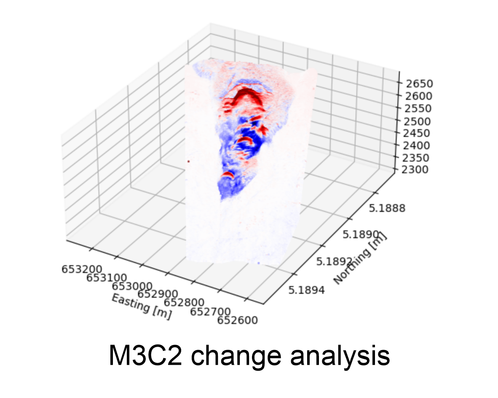
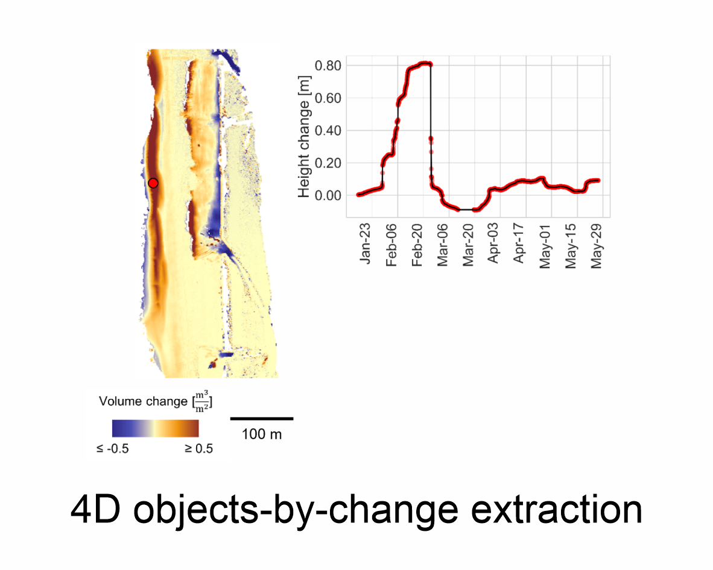
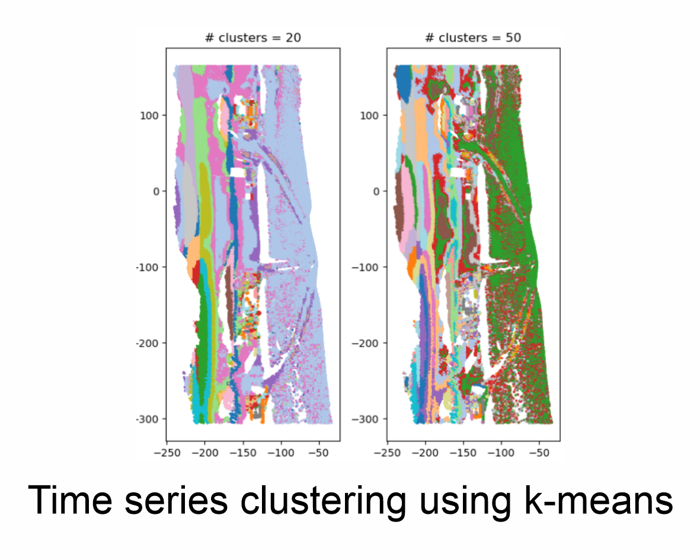
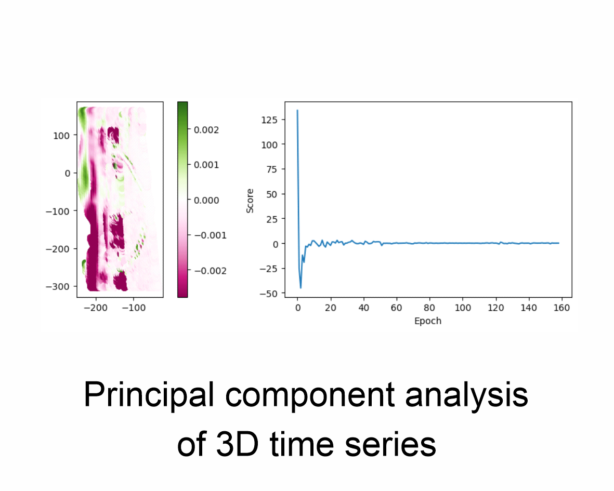

# Welcome to py4dgeo


[](https://opensource.org/licenses/MIT)
[](https://github.com/3dgeo-heidelberg/py4dgeo/actions/workflows/ci.yml)
[](https://pypi.org/project/py4dgeo)
[](https://py4dgeo.readthedocs.io/)
[](https://codecov.io/gh/3dgeo-heidelberg/py4dgeo)

`py4dgeo` is a `C++` library with `Python` bindings for change analysis in multitemporal and 4D point clouds.

Topographic 3D/4D point clouds are omnipresent in geosciences, environmental, ecological and archaeological sciences, robotics, and many more fields and applications. Technology to capture such data using laser scanning and photogrammetric techniques have evolved into standard tools. Dense time series of topographic point clouds are becoming increasing available and require tools for automatic analysis. Moreover, methods considering the full 4D (3D space + time) data are being developed in research and need to be made available in an accessible way with flexible integration into existent workflows.

The **main objective** of `py4dgeo` is to bundle and provide different methods of 3D/4D change analysis in a dedicated, comprehensive Python library.
`py4dgeo` is designed as an international open source project that can be integrated into almost any 3D and GIS software in the geodata domain supporting Python, e.g. as plugins.

`py4dgeo` is under *ongoing active development*.
Below, you find a list of [provided methods](#methods-provided-by-py4dgeo).


## 🔨 Methods provided by py4dgeo

* **M3C2 algorithm** ([Lague et al., 2013](#-literature)) for bitemporal point cloud distance computation.

* **M3C2-EP** (M3C2-EP; [Winiwarter et al., 2021](#-literature)) for statistical signal-noise separation in change analysis through error propagation.

* **4D objects-by-change** (4D-OBC; [Anders et al., 2021](#-literature)) for time series-based extraction of surface activities.

* **Correspondence-driven plane-based M3C2** ([Zahs et al., 2022](#-literature)) for lower uncertainty in 3D topographic change quantification  *[under active development]*.

* **Point cloud registration using standard ICP** by calculating and applying affine transformations to point clouds using a standard ICP implementations.

* **Point cloud registration with automatic determination of stable areas** ([Yang et al., 2022](https://doi.org/10.1515/jag-2022-0031)) for multitemporal change detection.

## 🎮 Examples

### Demo notebooks using methods provided by py4dgeo
|                                                                                                                                                              |                                                                                                                                                                 |
|--------------------------------------------------------------------------------------------------------------------------------------------------------------|-----------------------------------------------------------------------------------------------------------------------------------------------------------------|
| [](https://nbviewer.org/github/3dgeo-heidelberg/py4dgeo/blob/main/demo/m3c2-change_analysis.ipynb)       | [](https://nbviewer.org/github/3dgeo-heidelberg/py4dgeo/blob/main/demo/m3c2ep_change_analysis.ipynb)      |
| [](https://nbviewer.org/github/3dgeo-heidelberg/py4dgeo/blob/main/demo/4dobc-change_analysis.ipynb)          | [](https://nbviewer.org/github/3dgeo-heidelberg/py4dgeo/blob/main/demo/kmeans_clustering_of_time_series.ipynb) |
| [](https://nbviewer.org/github/3dgeo-heidelberg/py4dgeo/blob/main/demo/principal_component_analysis_of_time_series.ipynb) | [](https://nbviewer.org/github/3dgeo-heidelberg/py4dgeo/blob/main/jupyter/pbm3c2.ipynb)                                   |
 [](https://nbviewer.org/github/3dgeo-heidelberg/py4dgeo/blob/main/demo/registration_standard_ICP.ipynb)          |

## 💻 Installation

### Prerequisites

Using py4dgeo requires the following software installed:

* 64-bit Python `>= 3.9` (32-bit installations might cause trouble during installation of dependencies)

In order to build the package from source, the following tools are also needed.

* A C++17-compliant compiler
* CMake `>= 3.9`
* Doxygen (optional, documentation building is skipped if missing)

### Installing py4dgeo

The preferred way of installing `py4dgeo` is using `pip`.

### Installing the release version using pip

`py4dgeo` can be installed using `pip` to obtain the [current release](https://pypi.org/project/py4dgeo/):

```
python -m pip install py4dgeo
```

### Building from source using pip

The following sequence of commands is used to build `py4dgeo` from source:

```
git clone --recursive https://github.com/3dgeo-heidelberg/py4dgeo.git
cd py4dgeo
python -m pip install -v --editable .
```

The `--editable` flag allows you to change the Python sources of `py4dgeo` without
reinstalling the package. The `-v` flag enables verbose output which gives you
detailed information about the compilation process that you should include into
potential bug reports. To recompile the C++ source, please run `pip install` again.
In order to enable multi-threading on builds from source, your compiler toolchain
needs to support `OpenMP`.

If you want to contribute to the library's development you should also install
its additional Python dependencies for testing and documentation building:

```
python -m pip install -r requirements-dev.txt
```

### Setting up py4dgeo using Docker

Additionally, `py4dgeo` provides a Docker image that allows to explore
the library using JupyterLab. The image can be locally built and run with
the following commands:

```
docker build -t py4dgeo:latest .
docker run -t -p 8888:8888 py4dgeo:latest
```

## 🐍 Documentation of software usage

As a starting point, please have a look to the [Jupyter Notebooks](jupyter) available in the repository and find the `py4dgeo` documentation [on readthedocs](https://py4dgeo.readthedocs.io/en/latest/intro.html).

## 🌐 Published test data

<!-- TODO: integrate example notebooks for these use cases and data -->

If you are looking for data to test different methods, consider the following open data publications:

### Hourly TLS point clouds of a sandy beach

<a href="https://doi.org/10.1038/s41597-022-01291-9" target="_blank"></a>
<br>
Vos et al. (2022): [https://doi.org/10.1038/s41597-022-01291-9](https://doi.org/10.1038/s41597-022-01291-9).


### By-weekly TLS point clouds of an Alpine rock glacier

<a href="https://doi.org/10.11588/data/TGSVUI" target="_blank"></a>
<br>
Zahs et al. (2022): [https://doi.org/10.11588/data/TGSVUI](https://doi.org/10.11588/data/TGSVUI).


## 📑 Citation
Please cite py4dgeo when using it in your research and reference the appropriate release version.

<!-- TODO: All releases of py4dgeo are listed on Zenodo where you will find the citation information including DOI. -->

```
article{py4dgeo,
author = {py4dgeo Development Core Team}
title = {py4dgeo: library for change analysis in 4D point clouds},
journal = {},
year = {2022},
number = {},
volume = {},
doi = {},
url = {https://github.com/3dgeo-heidelberg/py4dgeo},
}
 ```

## 💟 Funding / Acknowledgements
The initial software development was supported by the [**Scientific Software Center (SSC)**](https://ssc.iwr.uni-heidelberg.de/) in the Open Call 2021. The scientific software project is further supported by the research projects [**CharAct4D**](https://www.uni-heidelberg.de/charact4d) and [**AImon5.0**](https://www.uni-heidelberg.de/aimon).

## 🔔 Contact / Bugs / Feature Requests

You think you have found a bug or have specific request for a new feature? Please open a new issue in the online code repository on Github. Also for general questions please use the issue system.

Scientific requests can be directed to the [3DGeo Research Group Heidelberg](https://uni-heidelberg.de/3dgeo) and its respective members.

## 📜 License

See [LICENSE.md](LICENSE.md).


## 📚 Literature

* Anders, K., Winiwarter, L., Mara, H., Lindenbergh, R., Vos, S.E. & Höfle, B. (2021): Fully automatic spatiotemporal segmentation of 3D LiDAR time series for the extraction of natural surface changes. ISPRS Journal of Photogrammetry and Remote Sensing, 173, pp. 297-308. DOI: [10.1016/j.isprsjprs.2021.01.015](https://doi.org/10.1016/j.isprsjprs.2021.01.015).
* Lague, D., Brodu, N., & Leroux, J. (2013). Accurate 3D comparison of complex topography with terrestrial laser scanner: Application to the Rangitikei canyon (N-Z). ISPRS Journal of Photogrammetry and Remote Sensing, 82, pp. 10-26. DOI: [10.1016/j.isprsjprs.2013.04.009](https://doi.org/10.1016/j.isprsjprs.2013.04.009).
* Winiwarter, L., Anders, K., Höfle, B. (2021): M3C2-EP: Pushing the limits of 3D topographic point cloud change detection by error propagation. ISPRS Journal of Photogrammetry and Remote Sensing, 178, pp. 240–258. DOI: [10.1016/j.isprsjprs.2021.06.011](https://doi.org/10.1016/j.isprsjprs.2021.06.011).
* Zahs, V., Winiwarter, L., Anders, K., Williams, J.G., Rutzinger, M. & Höfle, B. (2022): Correspondence-driven plane-based M3C2 for lower uncertainty in 3D topographic change quantification. ISPRS Journal of Photogrammetry and Remote Sensing, 183, pp. 541-559. DOI: [10.1016/j.isprsjprs.2021.11.018](https://doi.org/10.1016/j.isprsjprs.2021.11.018).
